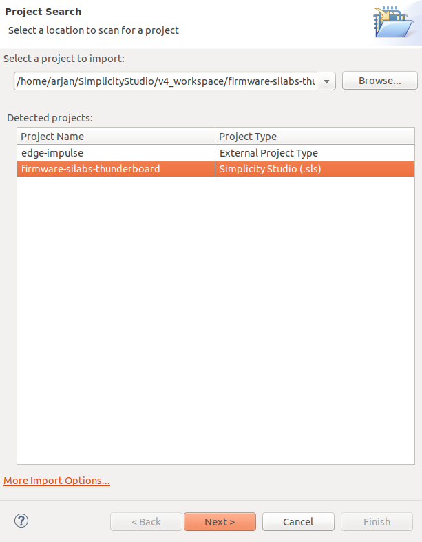
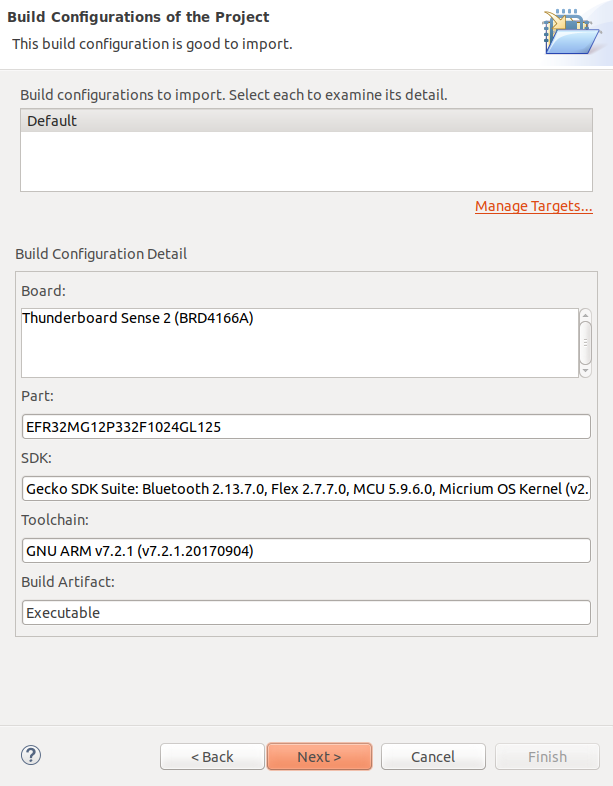
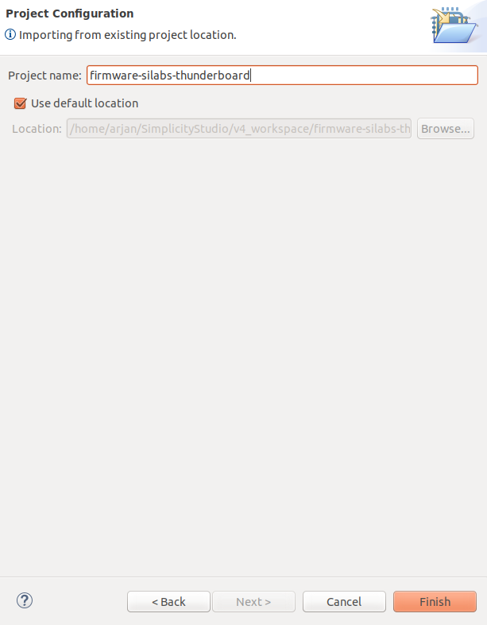

# example-standalone-inferencing-silabs-thunderboard
Builds and runs an exported impulse on the Silicon Labs Thunderboard Sense 2

## Importing the firmware in Simplicity Studio

1. First of all clone this repo in the Simplicity Studio workspace location.

2. Open Simplicity Studio and start the import wizard using the menu: <b>Project->Import->MCU Project...</b>

3. Browse and select the project directory. 2 Projects are now dectected. Select the <b>firmware-silabs-thunderboard</b> project and press <b>Next</b>

    

4. The Build configurations. For now it is important that the GCC compiler is added in the Simplicity Studio toolchain.

    
    
5. Finally, set the name of the project and set the project location. Make sure that the project name matches the name of the project directory.

    
    
    
## Building and flashing the firmware

- In Simplicity Studio building the project can be done via the menu: <b>Project->Build Project</b>

- Optional a buildscript (build.sh) is available which support the following commands:
  - ./build.sh --build
  - ./build.sh --clean
  - ./build.sh --flash
    Flash uses the JLink tools
