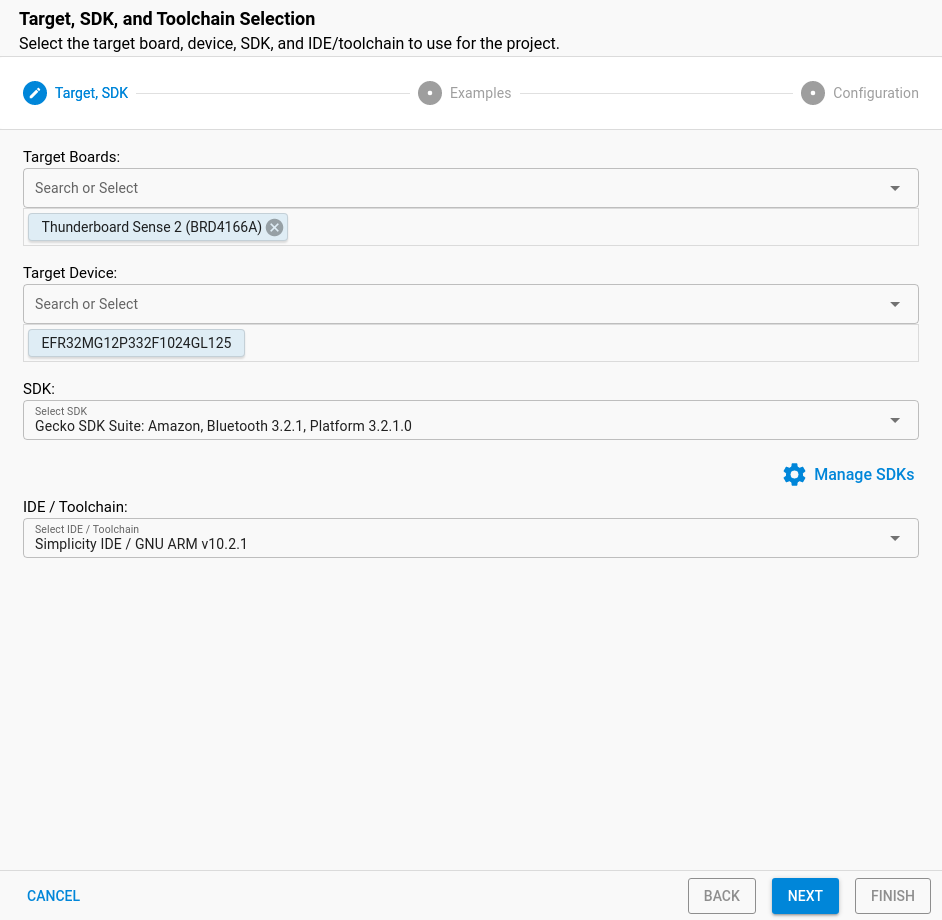
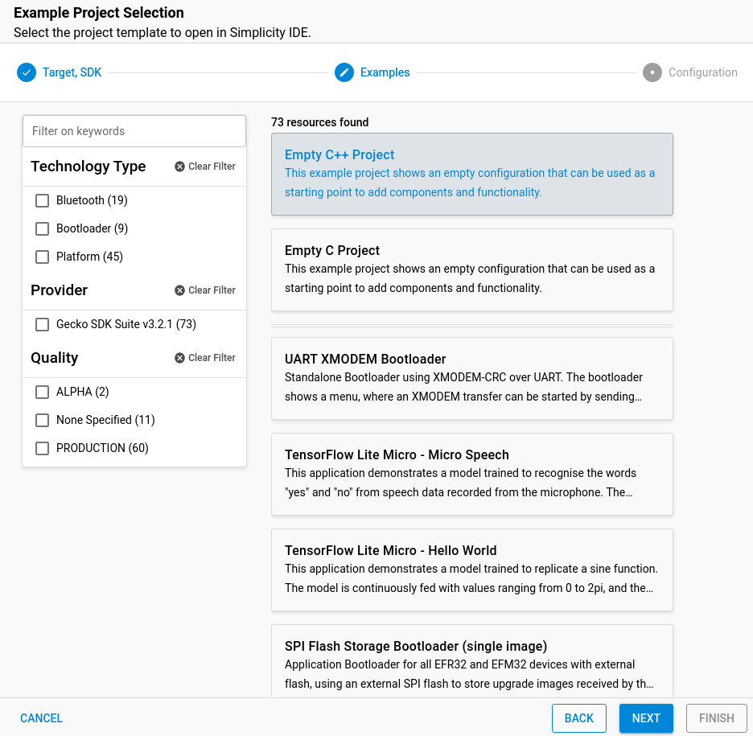
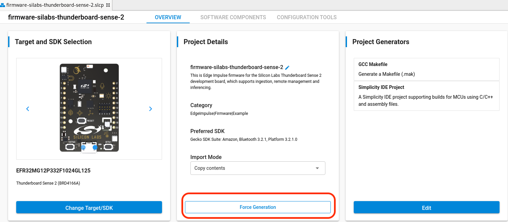

# Edge Impulse Example: stand-alone inferencing (SiLabs Thunderboard Sense 2)

This runs an exported impulse on the Silicon Labs Thunderboard Sense 2. See the documentation at [Running your impulse locally in Simplicity Studio](https://docs.edgeimpulse.com/docs/on-your-thunderboard-sense-2).

## Requirements

### Hardware

* [SiLabs Thunderboard Sense 2](https://www.silabs.com/development-tools/thunderboard/thunderboard-sense-two-kit) development board.

### Software

* Python 3 - make sure `python3` is in your PATH.

Then, either:

* [Simplicity Studio 5](https://www.silabs.com/developers/simplicity-studio) to build with an IDE. You'll also need:
    * Python 3.6.8 or higher.
    * Java 64 bit JVM 11 or higher:
        - available at [Amazon Correto](https://docs.aws.amazon.com/corretto/latest/corretto-11-ug/downloads-list.html) or [releases page](https://github.com/corretto/corretto-11/releases).
* Or, [GNU Arm Embedded Toolchain 10](https://developer.arm.com/tools-and-software/open-source-software/developer-tools/gnu-toolchain/gnu-rm/downloads) to build from the command line on Linux or macOS.
* Or, [Docker Desktop](https://www.docker.com/products/docker-desktop) to build using Docker.

## Building the application

1. First, clone or [download](https://github.com/edgeimpulse/example-standalone-inferencing-silabs-tb-sense-2/archive/refs/heads/master.zip) this repository:

    ```
    $ git clone https://github.com/edgeimpulse/example-standalone-inferencing-silabs-tb-sense-2
    ```

1. Take the C++ Library export of your Edge Impulse project, and copy the files into the `ei-workspace/edgeimpulse` folder.
1. Generate the Simplicity Studio project via:

    ```
    $ pip3 install pyyaml
    $ python3 update-slcp.py
    ```

Then, follow the build instructions for your environment below.

## Building using Simplicity Studio 5

### Importing the project

1.  Open Simplicity IDE and install the Gecko SDK 3.2.x.
1.  Create a new project via **File > New > Silicon Labs Project Wizard...**
1.  In the New Project Wizard select **Simplicity Studio > Silicon Labs MCU Project** and click **Next**
1.  Under 'board' select **Thunderboard Sense 2**.
1.  Select the correct SDK you installed in #1 and click **Next**.

    

1.  Select **Empty C++ Program** and click **Next**.

    

1.  Name the project `example-standalone-inferencing-silabs-tb-sense-2` (exactly this) and make sure **Copy contents** is selected before clicking **Finish**.

    

1. Under 'Project Explorer' select all files, except for *Includes* and delete them:

    

1. Then, navigate to the `example-standalone-inferencing-silabs-tb-sense-2/ei-workspace` folder (in this repository), and drag all files and folders into the 'Project explorer' window in Simplicity Studio. When prompted select **Copy files and folders** for this operation.
1. Then close, and reopen the project via: **Project > Close Project**, then **Project > Open Project**.
1. Double-click on `example-standalone-inferencing-silabs-tb-sense-2.slcp` to show the Simplicity Configurator.
1. Edit 'Project Generators' and disable 'IARM EMBEDDED WORKBENCH PROJECT':

    

1. Click **Force Generate** to regenerate all links and include paths.

    

1. You can now build your project, by right-clicking on the project name in the 'Project explorer' and choosing **Build Project**.
1. 🚀

### Building and flashing the firmware

1. In Simplicity Studio v5, select **Project > Build Project** to build the firmware.
1. Then, right click on the development board in the *Debug adapters* section of Simplicity Studio and select **Upload application**.

    

1. Under *Application image path* select the `GNU ARM v10.2.1 - Default/example-standalone-inferencing-silabs-tb-sense-2.bin` file and click **OK** to flash.

## Building from the command line

Building from the command line is only supported on macOS and Linux.

### Building the firmware

1. Set the `ARM_GCC_DIR` environment variable to a place where you've installed the GNU Arm Embedded Toolchain 10:

    ```
    $ export ARM_GCC_DIR=~/toolchains/gcc-arm-none-eabi-10-2020-q4-major/
    ```

1. Build the application:

    ```
    ./build.sh --build
    ```

### Flashing the firmware

You can either drag `./ei-workspace/build/debug/example-standalone-inferencing-silabs-tb-sense-2.bin` to the `TB004` mass-storage device (mounts as a USB flash drive), or flash with the JLink tools via:

```
$ ./build.sh --flash
```

## Building with Docker

### Building the firmware

1. Build the container:

    ```
    $ docker build -t thunderboard-sense-2-build .
    ```

1. Build the application:

    **macOS, Linux**

    ```
    $ docker run --rm -u $UID -v $PWD:/app:delegated thunderboard-sense-2-build /bin/bash build.sh --build
    ```

    **Windows**

    ```
    $ docker run --rm -v "%cd%":/app:delegated thunderboard-sense-2-build /bin/bash build.sh --build
    ```

#### Flashing the firmware

You can either drag `./ei-workspace/build/debug/example-standalone-inferencing-silabs-tb-sense-2.bin` to the `TB004` mass-storage device (mounts as a USB flash drive), or flash with the JLink tools via:

```
$ ./build.sh --flash
```

## Streaming results over BLE to your phone

Want to stream the results of your impulse over BLE to your phone? No problem! To do so:

1. Open a BLE scanner on your phone (tested with LightBlue on iOS) and :
    * Connect to the **Edge Impulse** device.
    * Subscribe to the `2A56` characteristic.
    * Decode the message as UTF8 (click on `HEX` in the top right corner in LightBlue to switch).
1. Start classification via:

    ```
    $ edge-impulse-run-impulse
    ```

1. You now see the classification results on your phone!

    

> **Note:** Only classification results greater than 0.80 are transmitted.
